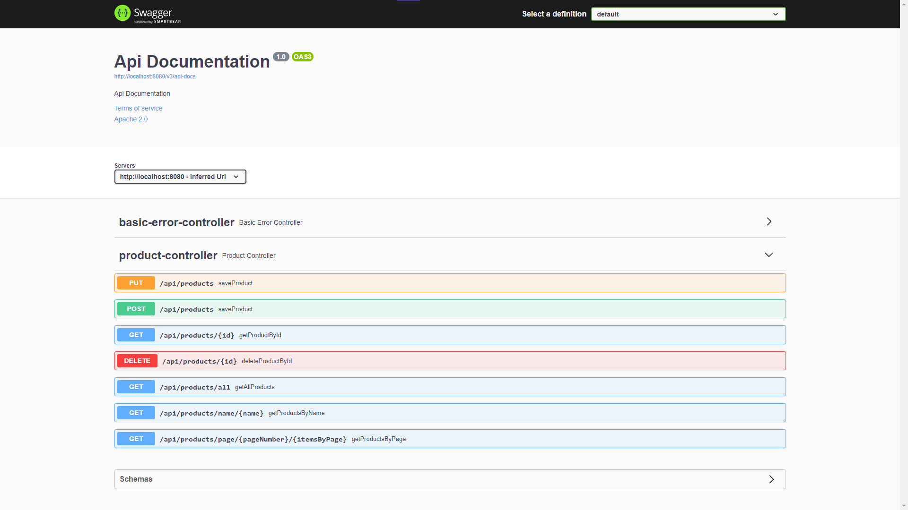

# Spring REST API
## Description
This microservice was created to manage products.
I created this project using Spring Boot, Swagger, JPA, Maven and MySQL database in Java 8.

In this project, I used the following patterns:
* MVC
* DTO
* Repository
* Service

## Technologies
* Java 8
* Maven
* Spring Boot
* Swagger 2
* JPA
* MySQL

## Screenshot

## Swagger URL
[Swagger URL link](http://localhost:8080/swagger-ui/index.html)
